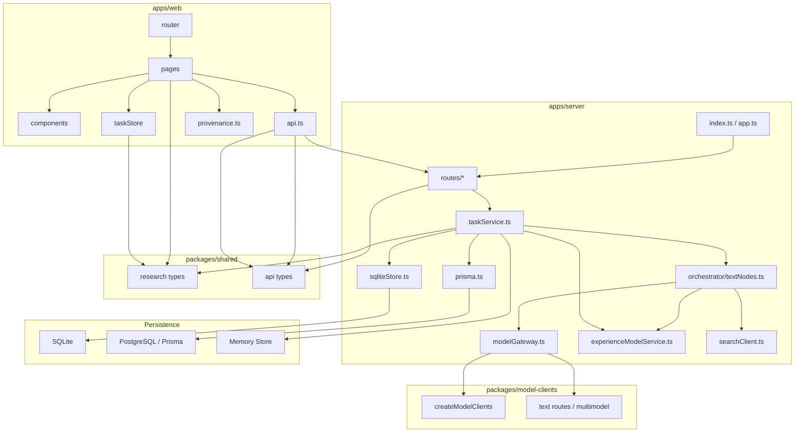

# 项目模块依赖架构图（研发版）

日期：2026-03-23

> 面向研发 / 架构评审。强调模块边界、依赖关系、数据流向。

---

## 模块依赖图

---

## 分层说明

### 1. 前端层

- 页面负责展示和交互
- `taskStore` 维护当前任务上下文
- `api.ts` 负责调用后端
- `provenance.ts` 负责可信度/来源边界摘要

### 2. 路由与 API 层

- `routes/tasks.ts`：任务主入口
- `routes/evidence.ts`：证据 / Vision / Persona / rerun
- `routes/reports.ts`：报告查询 / 审核 / 导出
- `routes/system.ts`：模型、体验模型、观测

### 3. 业务服务层

- `taskService.ts` 是核心编排入口与业务聚合层
- 统一管理任务状态、报告、审核、持久化选择

### 4. 编排层

- `textNodes.ts` 是实际研究执行逻辑
- 各节点通过 `modelGateway`、`searchClient`、`experienceModelService` 协作

### 5. 数据层

- SQLite：当前本地真实主路径
- Prisma/PostgreSQL：架构兼容，未作为本地主路径
- Memory：无 DB 时兜底

---

## 关键依赖判断

### 最关键模块

- `taskService.ts`
- `textNodes.ts`
- `modelGateway.ts`
- `sqliteStore.ts`
- `packages/shared`

### 最容易形成技术债的点

- 双持久化路径：SQLite / Prisma
- 编排节点与服务层的边界继续扩大后可能变重
- 共享状态对象过大，后续可能要拆分子域

