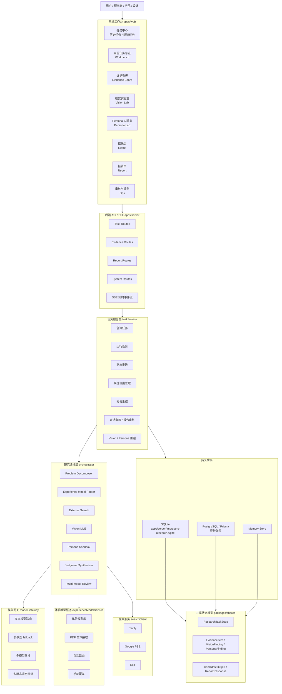
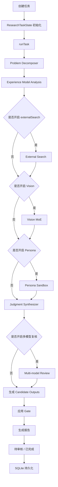
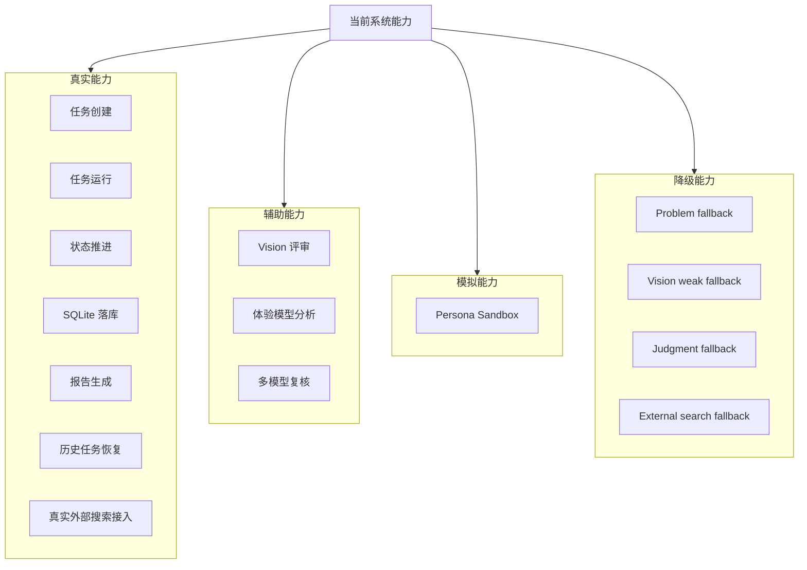

# 项目能力架构图

日期：2026-03-23

> 说明：下面使用 Mermaid 表达项目当前的能力架构，可直接在支持 Mermaid 的 Markdown 工具中渲染。

---

## 1. 总体能力架构图

---

## 2. 能力分层图

```mermaid
flowchart LR
    L1[接入层] --> L2[编排层]
    L2 --> L3[分析层]
    L3 --> L4[治理层]
    L4 --> L5[展示层]
    L5 --> L6[持久化层]

    subgraph L1[接入层]
        I1[文本输入]
        I2[设计图 / 截图]
        I3[附件引用]
        I4[任务创建]
    end

    subgraph L2[编排层]
        P1[任务状态机]
        P2[节点调度]
        P3[Checkpoint 保存]
        P4[SSE 实时流]
    end

    subgraph L3[分析层]
        N1[问题拆解]
        N2[体验模型分析]
        N3[外部搜索]
        N4[视觉评审]
        N5[Persona 模拟]
        N6[综合判断]
    end

    subgraph L4[治理层]
        G1[RQ 分级]
        G2[T1/T2/T3 证据分级]
        G3[Gate / blockedReasons]
        G4[证据审核]
        G5[报告审核]
        G6[重跑机制]
    end

    subgraph L5[展示层]
        V1[历史任务]
        V2[工作台]
        V3[结果页]
        V4[报告页]
        V5[审核页]
    end

    subgraph L6[持久化层]
        DB1[task_snapshots]
        DB2[reports]
        DB3[state_json / report_json]
    end
```

---

## 3. 任务执行流架构图

---

## 4. 当前真实能力与边界图

---

## 5. 一句话总结

这套架构当前可以概括为：

> **以前端工作台为入口，以任务状态机为核心，以研究编排为主干，以证据 / Vision / Persona / 体验模型为支路，以报告 / 审核 / 持久化为闭环的 AI 用研能力架构。**

