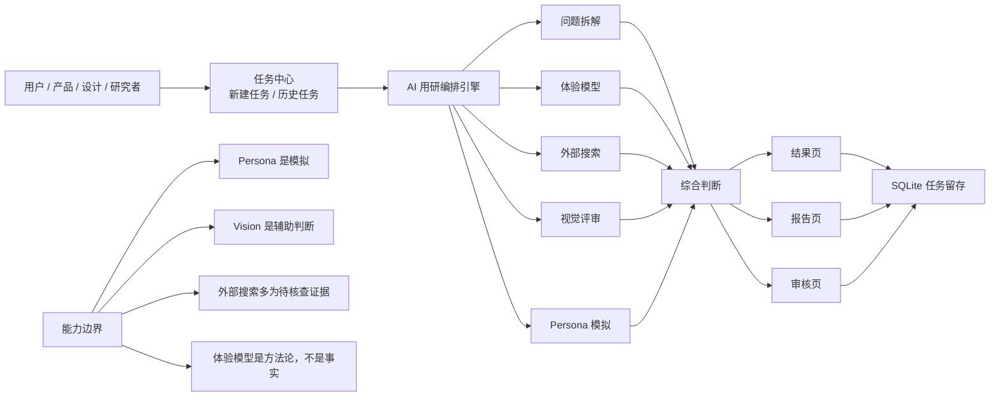

# 项目能力架构图（一页图简版）

日期：2026-03-23

> 面向老板 / 产品 / 汇报场景。强调“这是什么、能做什么、边界在哪里”。

---

## 一页图

---

## 一句话说明

这个系统当前已经形成：

> **任务创建 → AI 多支路分析 → 综合判断 → 报告生成 → 审核 → 数据留存**  
> 的完整闭环。

---

## 适合对外表达的结论

- 已具备可演示、可试跑、可复盘的 AI 用研工作台能力
- 已能保存真实任务和报告
- 已具备研究流程产品化雏形
- 当前仍需人工审核，不应包装为“全自动权威研究系统”

