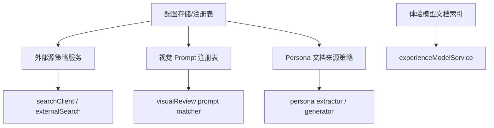

# 技术设计: 分析链路可配置化升级

## 技术方案

### 核心技术
- TypeScript / Fastify / SQLite
- 现有 orchestrator + service 分层复用
- 配置注册表 + 版本化存储
- 文档抽取与结构化索引

### 实现要点
- 外部源治理拆成两层：`enginePolicy` 与 `sourcePolicy`
- 视觉 prompt 拆成：`prompt registry` + `matcher`
- Persona 拆成：`document ingest` + `persona extraction` + `review grounding`
- 体验模型资料拆成：`pdf extract cache` + `chunk index` + `optional embedding backend`

## 架构设计


## 架构决策 ADR
### ADR-20260325-01: 先做注册表与索引层，再决定是否引入完整配置后台
**上下文:** 当前四条能力链路存在硬编码，但项目仍处于快速迭代期。  
**决策:** 第一阶段优先建设服务端可配置注册表、版本化配置模型和只读 / 简易写入接口，不直接上完整后台。  
**理由:** 先把“能力可配置”做扎实，再决定是否值得投入 UI 配置中心。  
**替代方案:** 直接上完整配置中心 → 拒绝原因: 成本高、当前需求边界还不稳定。  
**影响:** 服务端和 shared types 会先变复杂一些，但可控；Web 配置页可以后置。

### ADR-20260325-02: 体验模型先做 chunk/metadata 索引，向量化作为可选二阶段能力
**上下文:** 当前 PDF 直接抽取全文即可运行，但检索粒度粗；一次引入 pgvector / 向量库会扩大状态面。  
**决策:** 第一阶段新增 chunk/metadata 索引与关键词检索；向量化通过 feature flag / provider 接口预留。  
**理由:** 先解决“能定位、可追踪、可缓存”，再解决“相似度召回”。  
**替代方案:** 立即接入 pgvector → 拒绝原因: 当前用户尚未确认必须上数据库级向量检索。  
**影响:** 体验模型服务会多一层索引文件或表，但风险远低于直接引入向量库。

## API设计

### [GET] /api/system/source-policies
- **请求:** 无
- **响应:** 当前搜索引擎顺序、域名 allow/block 列表、站点信誉配置、版本号

### [PUT] /api/system/source-policies
- **请求:** 完整策略对象
- **响应:** 更新后的策略与版本号

### [GET] /api/system/visual-prompts
- **请求:** 无
- **响应:** 视觉 prompt 模板列表、标签、默认模板信息

### [GET] /api/system/persona-sources
- **请求:** 无
- **响应:** Persona 文档源配置与抽取状态

## 数据模型
```sql
-- 规划阶段，仅定义方向
analysis_policy (
  id text primary key,
  policy_type text not null,        -- source / visual_prompt / persona_source
  version integer not null,
  payload_json text not null,
  updated_at text not null
);

persona_document (
  id text primary key,
  source_name text not null,
  source_type text not null,        -- report / profile / upload
  extracted_json text not null,
  status text not null,
  updated_at text not null
);

experience_model_chunk (
  id text primary key,
  model_id text not null,
  section_title text,
  chunk_text text not null,
  keyword_json text,
  embedding_json text null
);
```

## 安全与性能
- **安全:** 配置更新必须做 schema 校验、版本记录、默认回退；禁止让运营直接写任意 prompt / 域名而无审计。
- **性能:** 配置读取走内存缓存 + 文件 / DB 版本校验；Persona 与体验模型索引生成采用离线或首次构建缓存。

## 测试与部署
- **测试:** 
  - source policy 筛选与热更新回归
  - visual prompt matcher 单元测试
  - persona 文档抽取 / 回退链路测试
  - experience model chunk index 构建与命中测试
- **部署:** 先本地 SQLite 方案；如果确认需要多实例共享，再升级到 PostgreSQL 持久化配置。

