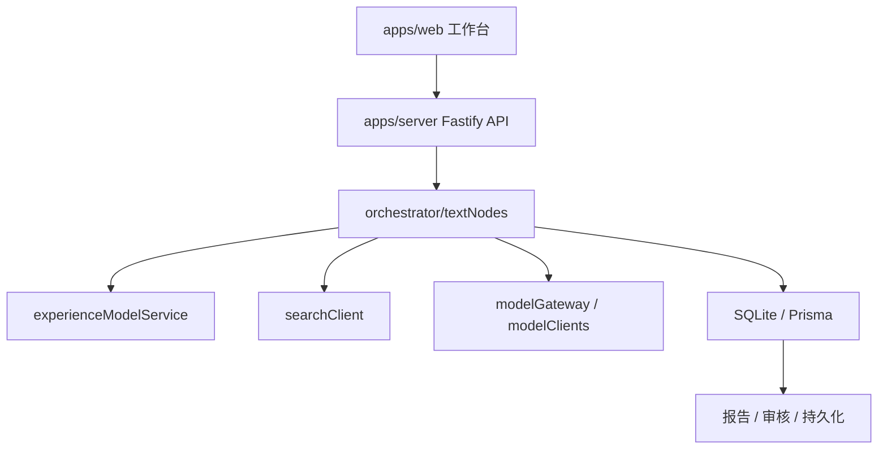
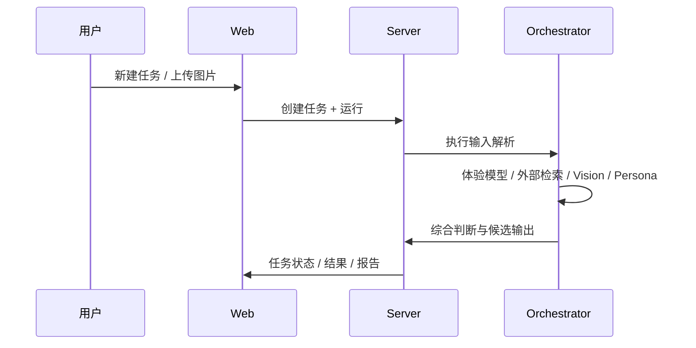

# 架构设计

## 总体架构

## 技术栈
- **后端:** Fastify、TypeScript、Prisma、better-sqlite3
- **前端:** React、Vite
- **数据:** SQLite（当前默认）、PostgreSQL（可切换）

## 核心流程

## 重大架构决策
完整的 ADR 存储在各变更的 how.md 中，本章节提供索引。

| adr_id | title | date | status | affected_modules | details |
|--------|-------|------|--------|------------------|---------|
| ADR-20260325-01 | 分析链路配置能力从硬编码转向注册表 + 策略层 | 2026-03-25 | 📝规划中 | server, web, shared | 待本次方案实施后补链接 |

